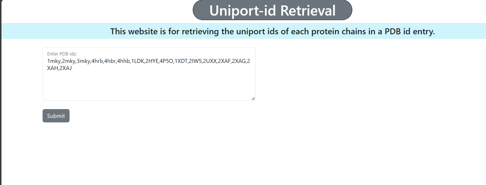
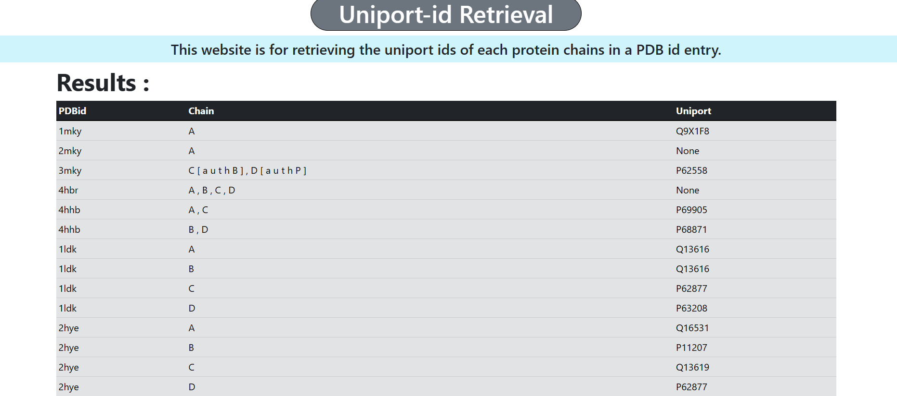

# Website: Uniport-id Retrieval 
> The website is used for the retrieval of the uniport id of protein chain. It takes takes the list of PDB id as input and return the Uniport by chain name wise. This simple website is build from the Flask frameowrk.

> [!NOTE]
>Before Running the programic files,  
 1. Set up virtual environment. For setting up the virtual environment, visit [here](https://packaging.python.org/en/latest/guides/installing-using-pip-and-virtual-environments/)
   
 2. After set up the virtual environment run [requirement.txt](requirement.txt) in the terminal window where the programic Folder is located.
   <pre>      pip install requirement.txt</pre>
 3. Before runnning [app.py](app.py) file. Please set up the flask variable. More detailed info how to set up is provided [here](https://flask.palletsprojects.com/en/1.1.x/config/)
 4. After setting up the above instructions. Run the [app.py](app.py) 
   <pre>                python app.py</pre>

> Flask website directory tree:
> <pre> 
>           FLASK_DEV
>           ___|
>           |---static
>           |       |-- style.css
>           |---templates
>           |        |-- base.html
>           |        |-- index.html
>           |        |-- user.html
>           |--app.py
>           |code_check_1.py </pre>
>
## Website
The demo view of the Uniport-id retrieval  website is shown below: 
 
 

